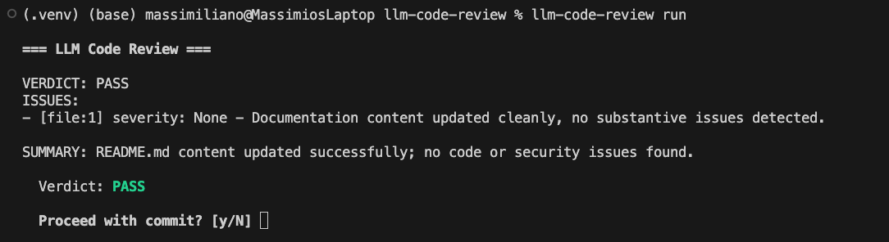

# 🔍 LLM Code Review

A git pre-commit hook that reviews your staged changes using a local LLM via [Ollama](https://ollama.com). No API keys. No cloud. Your code never leaves your machine.



### How it works

1. You run `git commit`, the pre-commit hook kicks in
2. Your staged diff is sent to a local Ollama model
3. The model reviews your code for bugs, security issues, and style
4. You get a verdict: ✅ PASS / ⚠️ WARN / ❌ FAIL
5. You choose whether to proceed or abort as normal

You can also run `llm-code-review run` manually at any time.

## 🚀 Quick start

### 1. Install Ollama

Download from [ollama.com/download](https://ollama.com/download) or `curl -fsSL https://ollama.com/install.sh | sh` (macOS, Linux).

```bash
ollama serve        # start the server
ollama pull qwen3.5:4b  # grab a model
```

### 2. Install llm-code-review

📌 Requires Python 3.11+
```bash
git clone https://github.com/massimilianoviola/llm-code-review.git
cd llm-code-review
pip install -e .
```

### 3. Hook it up

```bash
cd your-repo
llm-code-review install
```

### 4. Just commit

```bash
git add . && git commit -m "your message"
```

The review streams live to your terminal. You choose whether to proceed.
```
=== LLM Code Review ===

VERDICT: PASS
ISSUES: None detected
SUMMARY: README.md content updated successfully; no code or security issues found.

  Verdict: PASS

  Proceed with commit? [y/N] 
```

## 🛠️ Commands

| Command | Description |
|---|---|
| `llm-code-review run` | 📝 Review staged changes |
| `llm-code-review check` | 🏥 Verify Ollama server & model |
| `llm-code-review benchmark` | ⏱️ Compare model speeds — default: `qwen3.5:0.8b,2b,4b` |
| `llm-code-review install` | 🪝 Install the pre-commit hook |
| `llm-code-review uninstall` | 🗑️ Remove the pre-commit hook |

### Options for `run`

| Flag | Default | Description |
|---|---|---|
| `--model` | `qwen3.5:4b` | Ollama model to use |
| `--url` | `http://localhost:11434` | Ollama server URL |
| `--strict` | off | Also fail on ⚠️ WARN |
| `--no-interactive` | off | Skip prompt, auto-decide |

### Options for `benchmark`

| Flag | Default | Description |
|---|---|---|
| `--models` | `qwen3.5:0.8b,qwen3.5:2b,qwen3.5:4b` | Comma-separated list of models |
| `--url` | `http://localhost:11434` | Ollama server URL |

### Options for `check`

| Flag | Default | Description |
|---|---|---|
| `--model` | `qwen3.5:4b` | Model to check |
| `--url` | `http://localhost:11434` | Ollama server URL |

### Options for `install` / `uninstall`

| Flag | Default | Description |
|---|---|---|
| `--repo` | cwd | Path to git repository (install hook remotely without cd-ing) |


## ⚙️ Configuration

Optionally drop a `.llm-code-review.toml` in your repo root to override defaults:

```toml
model = "qwen3.5:4b"
ollama_url = "http://localhost:11434"
strict = false
timeout = 120
```

**Precedence** (each layer overrides the previous): defaults → `.llm-code-review.toml` → CLI flags


## 🧑‍💻 Development

```bash
python -m venv .venv && source .venv/bin/activate
pip install -e ".[dev]"
```

```bash
pytest
ruff check --fix
ruff format
```
